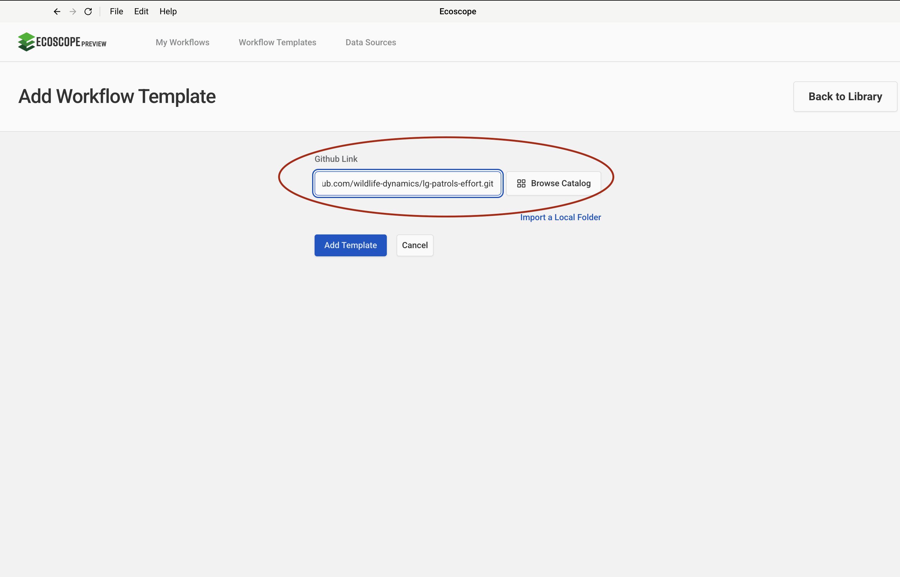
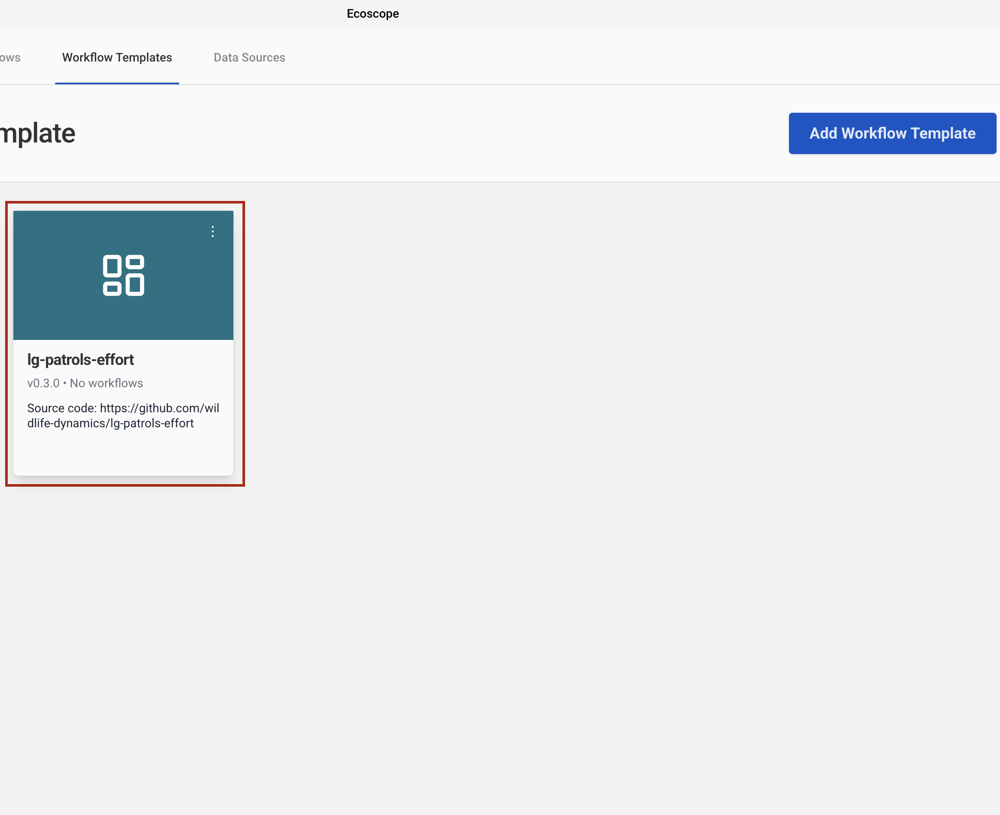
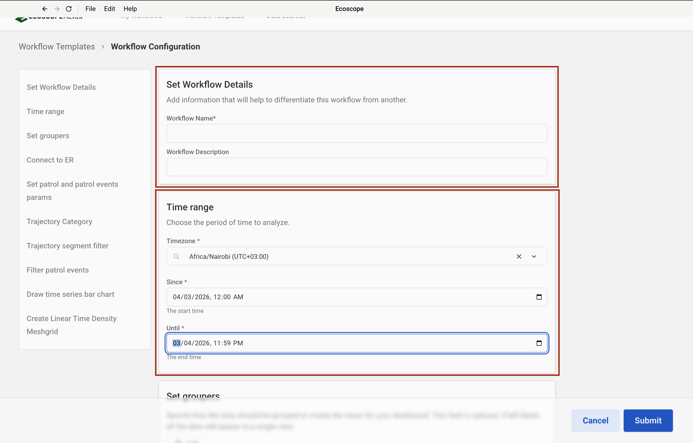
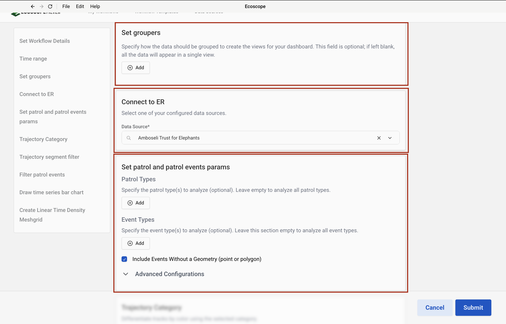
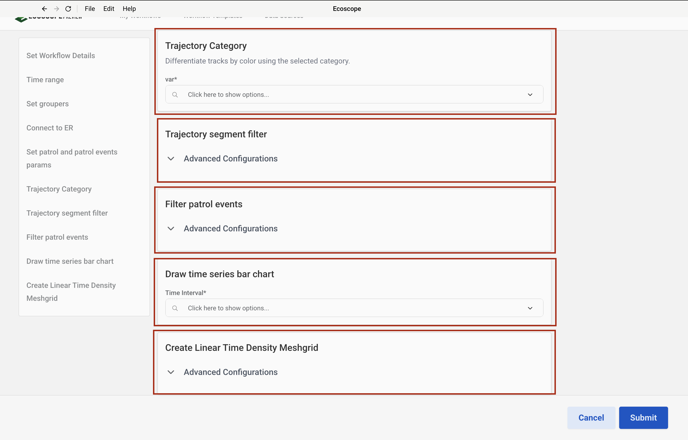

# LG Patrols Effort Workflow — User Guide

This guide walks you through configuring and running the LG Patrols Effort Workflow, which generates a patrol effort analysis report for Lion Guardians rangers in the Amboseli ecosystem sourced from EarthRanger.

---

## Overview

The workflow produces, for each patrol group:

- A **Patrol Events map** (scatter plot of events by type)
- A **Patrol Trajectories map** (tracks coloured by a user-selected category)
- A **Linear Time Density map** (patrol coverage heat map)
- A **time series bar chart** and **pie chart** of patrol events
- **Summary CSV tables** — per guardian, patrol type, event type, and monthly breakdown
- A **Word document report** (`.docx`) with a cover page and one section per group
- An **interactive widget dashboard**

---

## Prerequisites

Before running the workflow, ensure you have:

- Access to an **EarthRanger** instance with a configured data source
- The patrol types and event types you want to analyse (leave blank to include all)

> The two spatial boundary files (group ranch boundaries and conflict hotspot areas) are downloaded automatically from Dropbox — no local copies are required.

---

## Step-by-Step Configuration

### Step 1 — Add the Workflow Template

In the workflow runner, go to **Workflow Templates** and click **Add Workflow Template**. Paste the GitHub repository URL into the **Github Link** field:

```
https://github.com/wildlife-dynamics/lg-patrols-effort.git
```

Then click **Add Template**.



---

### Step 2 — Add an EarthRanger Connection

Navigate to **Data Sources** and add a new EarthRanger connection. Fill in:

- **Data Source Name** — a label to identify this connection
- **EarthRanger URL** — your instance URL (e.g. `your-site.pamdas.org`)
- **EarthRanger Username** and **EarthRanger Password**

> Credentials are not validated at setup time. Any authentication errors will appear when the workflow runs.


---

### Step 3 — Select the Workflow

After the template is added, it appears in the **Workflow Templates** list as **lg-patrols-effort**. Click it to open the workflow configuration form.

> The card may show **Initializing…** briefly while the environment is set up.



---

### Step 4 — Configure Workflow Details and Time Range

The configuration form opens with two sections at the top.

**Set Workflow Details**

| Field | Description |
|-------|-------------|
| Workflow Name | A short name to identify this run |
| Workflow Description | Optional notes about the run (e.g. date range or patrol group) |

**Time range**

| Field | Description |
|-------|-------------|
| Timezone | Select the local timezone (e.g. `Africa/Nairobi UTC+03:00`) |
| Since | Start date and time of the analysis period |
| Until | End date and time of the analysis period |

All patrol tracks, events, and metrics are computed within this window.



---

### Step 5 — Set Groupers, Connect to EarthRanger, and Set Patrol Parameters

Scroll down to configure three sections.

**Set Groupers** *(optional)*

Groupers control how the workflow partitions data for per-group outputs. If left blank, all data appears in a single view. Click **Add** to add a grouper. Available options:

| Grouper | Effect |
|---------|--------|
| Patrol Type | One map, metrics, and report section per patrol type |
| Patrol Serial Number | One output per patrol serial |
| Patrol Subject | One output per guardian ranger |

**Connect to EarthRanger**

Select the EarthRanger data source configured in Step 2 from the **Connect to EarthRanger** dropdown.

**Set patrol and patrol events params**

| Field | Description |
|-------|-------------|
| Patrol Types | Filter to specific patrol types (leave empty to include all) |
| Event Types | Filter to specific event types (leave empty to include all) |
| Include Events Without a Geometry | Check to include events with no point or polygon location |

Expand **Advanced Configurations** to access additional query parameters such as patrol status and overlap behaviour.



---

### Step 6 — Trajectory Category, Segment Filter, Event Filter, Bar Chart, and Time Density

The final section of the form contains five configuration panels.

**Trajectory Category**

Select the column used to colour patrol tracks on the Trajectories map:

| Option | Effect |
|--------|--------|
| Patrol Type | Tracks coloured by patrol activity type |
| Patrol Subject | Tracks coloured per ranger |
| Patrol Serial Number | Tracks coloured per individual patrol |

**Trajectory segment filter** *(Advanced Configurations)*

These parameters remove GPS noise and biologically unrealistic movements before trajectory analysis.

| Field | Default | Description |
|-------|---------|-------------|
| Minimum Segment Length (m) | `10` | Discard segments shorter than this distance |
| Maximum Segment Length (m) | `100000` | Discard segments longer than this distance |
| Minimum Segment Duration (s) | `10` | Discard segments shorter than this duration |
| Maximum Segment Duration (s) | `21600` | Discard segments longer than this duration (6 hours) |
| Minimum Segment Speed (km/h) | `1` | Discard segments below this average speed |
| Maximum Segment Speed (km/h) | `7` | Discard segments above this average speed |

**Filter patrol events** *(Advanced Configurations)*

Optionally restrict events to a region of interest (ROI). Leave blank to include all events within the time range.

**Draw time series bar chart**

| Field | Description |
|-------|-------------|
| Time Interval | The time bucket used to group events on the x-axis (e.g. day, week, month) |

**Create Linear Time Density Meshgrid** *(Advanced Configurations)*

Controls the resolution of the patrol coverage raster. Leave at defaults for most analyses.



---

## Running the Workflow

Once all parameters are configured, click **Submit**. The runner will:

1. Pull patrol tracks and events from EarthRanger for the specified time range.
2. Download the static boundary files (group ranches, conflict hotspots).
3. Convert observations to relocations and build trajectory segments.
4. Generate the Patrol Events, Patrol Trajectories, and Linear Time Density maps.
5. Compute per-guardian, patrol type, event type, and monthly summary tables.
6. Render the time series bar chart and pie chart.
7. Assemble the Word report (cover page + per-group sections) and the dashboard.
8. Save all outputs to the directory specified by `ECOSCOPE_WORKFLOWS_RESULTS`.

---

## Output Files

All outputs are written to `$ECOSCOPE_WORKFLOWS_RESULTS/`:

| File | Description |
|------|-------------|
| `events.geoparquet` | Patrol events with display names and timezone-converted timestamps |
| `trajectories.geoparquet` | Patrol segments with speed and distance |
| `<group>_events.html` | Interactive patrol events map per group |
| `<group>_patrol_trajectories.html` | Interactive patrol trajectories map per group |
| `<group>_time_density.html` | Interactive linear time density map per group |
| `<group>_events.png` | Screenshot of the patrol events map (2× resolution) |
| `<group>_time_density.png` | Screenshot of the time density map (2× resolution) |
| `<group>_patrols_pie_chart.png` | Screenshot of the event type pie chart (2× resolution) |
| `<group>_bar_chart.png` | Screenshot of the events time series bar chart (2× resolution) |
| `<group>_guardian_patrol.csv` | Per-guardian patrol effort (patrols, distance, time) |
| `<group>_guardian_events.csv` | Per-guardian event count |
| `<group>_pivot_guardian_events.csv` | Guardian × event type pivot table |
| `<group>_monthly_patrol_efforts.csv` | Monthly patrol effort summary |
| `<group>_event_types.csv` | Per-event-type count |
| `context_page.docx` | Rendered report cover page |
| `<group>.docx` | Per-grouper report section |
| Merged report `.docx` | Final combined Word report |
