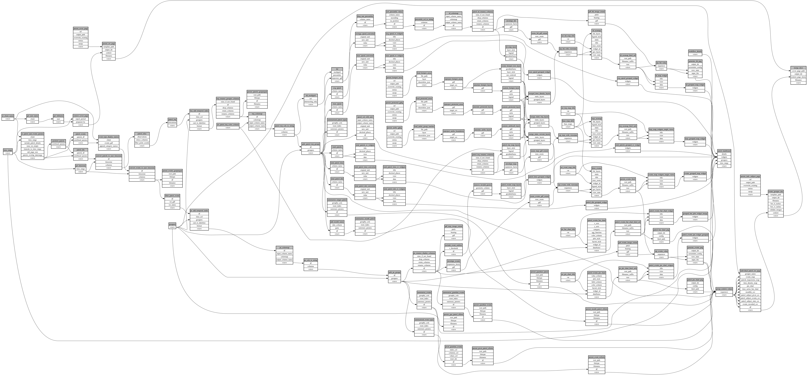

```
# AUTOGENERATED BY ECOSCOPE-WORKFLOWS; see fingerprint in README.md for details

```

```yaml
# fingerprint:
artifacts_sha256_basic: 2b5fd0a956df9a19deab5c523dc406289b03923675ee628260574754b57b750c
artifacts_sha256_strict: 1cc3aef852aca88d65fcf1ad2cd55fb847898b3a764e38872b931a6a0d38219d
installed_requirements:
- channel: https://repo.prefix.dev/ecoscope-workflows/
  name: ecoscope-workflows-core
  version: {version: ==0.22.17}
- channel: https://repo.prefix.dev/ecoscope-workflows/
  name: ecoscope-workflows-ext-ecoscope
  version: {version: ==0.22.17}
- channel: https://repo.prefix.dev/ecoscope-workflows-custom/
  name: ecoscope-workflows-ext-custom
  version: {version: ==0.0.40}
- channel: https://repo.prefix.dev/ecoscope-workflows-custom/
  name: ecoscope-workflows-ext-ste
  version: {version: ==0.0.18}
- channel: https://repo.prefix.dev/ecoscope-workflows-custom/
  name: ecoscope-workflows-ext-mnc
  version: {version: ==0.0.7}
- channel: https://repo.prefix.dev/ecoscope-workflows-custom/
  name: ecoscope-workflows-ext-icf
  version: {version: ==0.0.0}
- channel: https://repo.prefix.dev/ecoscope-workflows-custom/
  name: ecoscope-workflows-ext-big-life
  version: {version: ==0.0.8}
- channel: https://repo.prefix.dev/ecoscope-workflows-custom/
  name: ecoscope-workflows-ext-lion-guardians
  version: {version: ==0.0.6}
params_sha256: 1b69ff7a71d7b39f60d8c7b38d5427b080a7ac22baee433c41a6880127ed5cd1
spec_sha256: 8132b853f645ec494ce02c09a7f2c75d5a72e43a803e9098077f678125d8f3e0

```

# ecoscope-workflows-patrols-workflow


